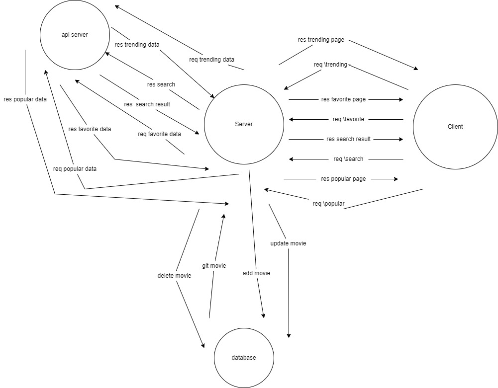

# Movies-Library-V1

**Author Name**: Ahmad Masadeh

## WRRC

## Overview
Best Server Ever to Movies
## Getting Started
1. Clone this repo.
2. Cd to repo local directory.
3. npm init -y.
4. npm install express cors.
5. Install PostgreSQL
6. I run mt postgres server (sqlstart)
7. psql then create a database (CREATE DATABASE name-of-the-database)
8. npm install pg
9. Create the database URL
10. Do the configurations for pg (require, new pg.Client, clint.connect)
11. End the take a post request
12. app.use(express.json()) (top of the all end points)
13. build the function that insert in database
14. build a function that get from the database

15. We built an end point to get a specific record from the database:

    1. We created an endpoint with a variable name (id)(/path/:id)
    2. We created the Handler
    3. We got the id from req.params.id
    4. We add the SELECT statement from the database based on the id.
    5. We returned the result.rows

16. We built an end point to update a specific record in the database:

    1. We created an endpoint with a variable name (id)(/path/:id)
    2. We created our Handler
    3. We got the id from req.params.id
    4. We got the new data from req.body
    5. We did the UPDATE statement for the database and we retune the updated 
    6. We returned to the client the updated data with status 200

17. We built an end point to delete a specific record from database based on the id:

    1. We created an endpoint with a variable name (id)(/path/:id)
    2. We created our Handler
    3. We got the id from req.params.id
    4. We did the DELETE statement fro the database
    5. We return a response with status of 204 and an empty object.

## Project Features
- Movies Details
- Search Movies
- Search Popular Movies
- Search latest Movies
- Add Movie
- Get Movies you add it